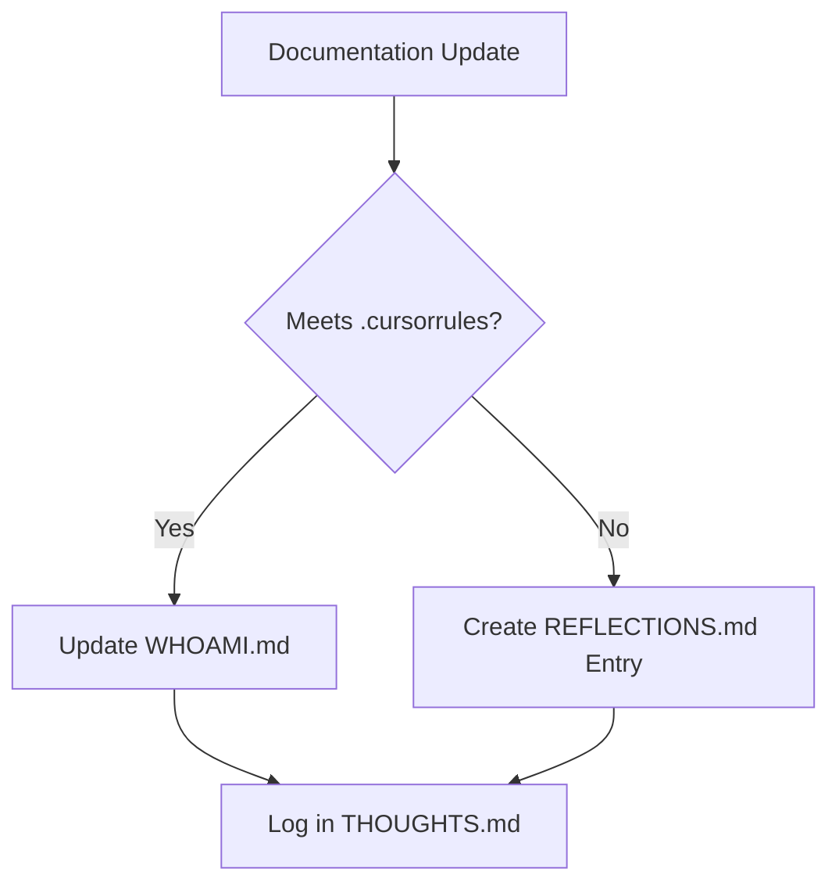

# PROMPT

- **Immediate Priorities:**
  - Finalize implementation of core backend features.
  - Ensure all endpoints are tested and documented.
- **Code Quality:**
  - Follow PEP8 guidelines (verified via Ruff).
- **Documentation:**
  - Update API docs and integration examples.
- **Workflow:**
  - Use GitHub Actions for CI/CD automation and testing.

# Active Development Priorities

## Current Focus (2024-02-20)
1. Implement documentation audit system
2. Validate file storage locations against .cursorrules
3. Ensure WHOAMI.md updates on every execution cycle

## Validation Requirements
- [ ] Verify all context files reside in root/context/
- [ ] Confirm THOUGHTS.md contains timestamped entries
- [ ] Check RULES.md version matches latest guidelines

## Compliance Targets
