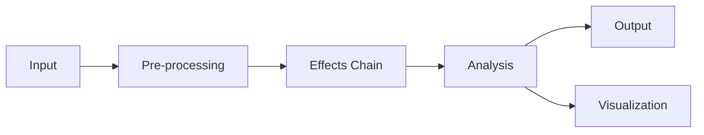

# Audio Processing Guide

This guide provides a comprehensive overview of AudioKit's audio processing capabilities, including real-time processing, effects, and analysis.

## Overview

AudioKit provides a powerful set of tools for processing audio in real-time. This includes:

- Signal processing and effects
- Audio analysis and feature extraction
- Real-time visualization
- Multi-channel audio support

## Architecture

The audio processing pipeline consists of several key components:



## Key Concepts

### Audio Buffers

Audio data is processed in chunks called buffers. The default buffer size is 1024 samples, which provides a good balance between latency and processing overhead.

```python
from audiokit import AudioBuffer

# Create a stereo buffer
buffer = AudioBuffer(channels=2, size=1024)

# Process the buffer
processed = effects_chain.process(buffer)
```

### Effects Chain

Effects can be chained together to create complex processing pipelines:

```python
from audiokit.effects import Reverb, Delay, Compressor

# Create an effects chain
chain = [
    Reverb(room_size=0.8, damping=0.5),
    Delay(time=0.3, feedback=0.4),
    Compressor(threshold=-20, ratio=4.0)
]

# Process audio through the chain
for effect in chain:
    buffer = effect.process(buffer)
```

## Best Practices

1. **Buffer Management**
   - Keep buffer sizes power-of-two
   - Consider latency requirements
   - Use appropriate sample rates

2. **Performance Optimization**
   - Profile your processing chain
   - Use vectorized operations
   - Consider multi-threading for heavy processing

3. **Error Handling**
   - Handle buffer underruns
   - Implement graceful fallbacks
   - Monitor processing load

## Advanced Topics

### Real-time Analysis

```python
from audiokit.analysis import SpectralAnalyzer

analyzer = SpectralAnalyzer(fft_size=2048)
spectrum = analyzer.analyze(buffer)

# Get frequency peaks
peaks = spectrum.find_peaks(threshold=-60)
```

### Multi-channel Processing

```python
# Process 5.1 surround sound
surround_buffer = AudioBuffer(channels=6)

# Apply channel-specific processing
for channel in range(surround_buffer.channels):
    channel_data = surround_buffer.get_channel(channel)
    processed = process_channel(channel_data)
    surround_buffer.set_channel(channel, processed)
```

## Troubleshooting

Common issues and their solutions:

| Issue | Possible Cause | Solution |
|-------|---------------|----------|
| Audio glitches | Buffer underruns | Increase buffer size |
| High CPU usage | Inefficient processing | Profile and optimize |
| Latency | Large buffer size | Reduce buffer size |

## API Reference

For detailed API documentation, see:

- [AudioBuffer API](../api/audio/buffer.md)
- [Effects API](../api/effects/index.md)
- [Analysis API](../api/analysis/index.md)

## Examples

See the [examples directory](../examples/audio_processing/) for complete working examples. 