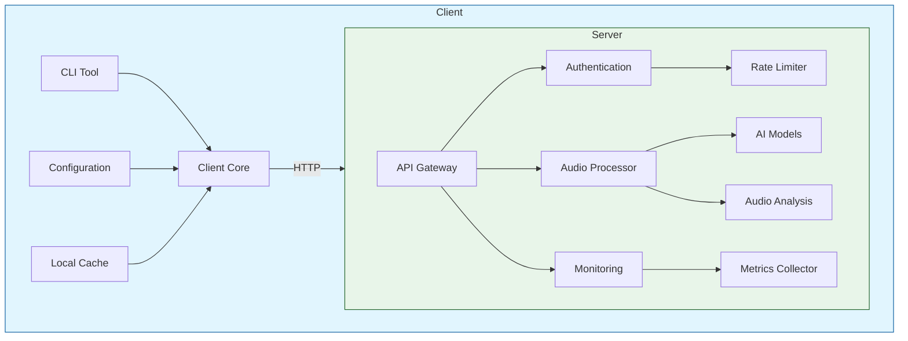
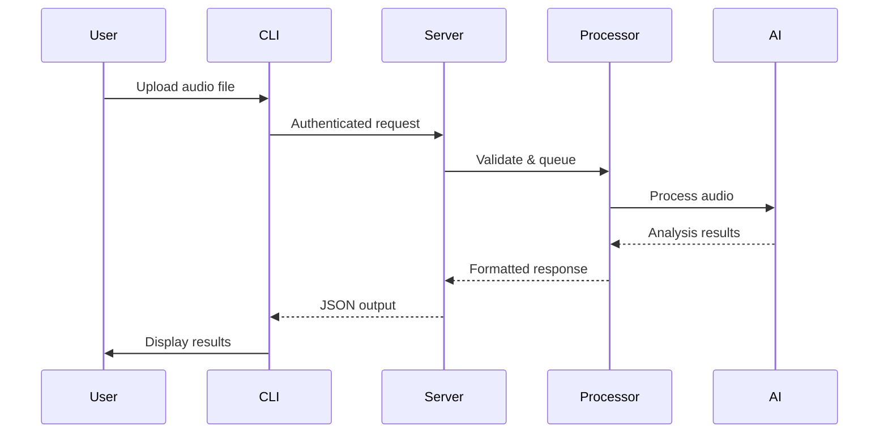

# AudioKit Architecture Overview

## High-Level Architecture

## Core Components

### Client Package (`audiokit`)
| Component          | Responsibility                          | Technology Stack     |
|---------------------|-----------------------------------------|----------------------|
| CLI Interface       | User command processing                 | Click, Rich          |
| API Client          | Server communication                    | HTTPX, Pydantic      |
| Configuration       | Settings management                     | Pydantic, Dotenv     |
| Error Handling      | Unified error reporting                 | Custom Exceptions    |
| Validation          | Input sanitization                      | Pydantic, Typeguard  |

### AI Server (`audiokit-ai`)
| Component          | Responsibility                          | Technology Stack     |
|---------------------|-----------------------------------------|----------------------|
| API Gateway         | Request routing                         | FastAPI, Uvicorn     |
| Authentication      | Security controls                       | API Keys, OAuth2     |
| Audio Processing    | Core analysis pipeline                  | Librosa, Soundfile   |
| AI Integration       | Model inference                         | PyTorch, ONNX        |
| Monitoring          | System observability                    | Prometheus, Grafana |

### Shared Core (`audiokit-core`)
| Component          | Responsibility                          | Technology Stack     |
|---------------------|-----------------------------------------|----------------------|
| Data Models         | Shared API schemas                      | Pydantic             |
| Exceptions         | Common error hierarchy                 | Python Exceptions    |
| Interfaces          | Plugin contracts                       | Protocol Classes     |

## Key Architectural Decisions

1. **Protocol Design**
   - REST over gRPC for simplicity
   - JSON for request/response bodies
   - API versioning through URL paths
   - Standardized error codes (RFC 7807)

2. **Security Model**
   - API key authentication
   - Rate limiting per API key
   - Input validation middleware
   - HTTPS enforcement
   - Request signing (future)

3. **Performance Tradeoffs**
   - Async I/O for network operations
   - Synchronous CPU-bound processing
   - In-memory audio processing
   - Batch processing support

## Data Flow

## Scalability Approach

### Horizontal Scaling
- Stateless API endpoints
- Redis-backed rate limiting
- Shared nothing architecture
- Containerized deployment

### Vertical Optimization
- Memory-mapped audio processing
- GPU acceleration for AI models
- JIT compilation (Numba)
- Process pooling

## Monitoring & Observability

| Aspect              | Tools                                  | Metrics Tracked          |
|---------------------|----------------------------------------|--------------------------|
| API Performance     | Prometheus, Grafana                    | Latency, Throughput      |
| Error Tracking      | Sentry, ELK Stack                      | Error Rates, Types       |
| Resource Usage      | cAdvisor, Node Exporter                | CPU/Memory, GPU Usage    |
| Audit Logging       | Loki, Graylog                           | Access Patterns         |

## Future Directions

1. **Extensibility**
   - Plugin system architecture
   - Custom processing hooks
   - Format converter interface

2. **Advanced Features**
   - Real-time audio streaming
   - Distributed processing
   - Model versioning A/B testing

3. **Ecosystem Integration**
   - CI/CD pipelines
   - Terraform deployment
   - Kubernetes operators

See also: [ROADMAP.md](ROADMAP.md) | [REFLECTIONS.md](REFLECTIONS.md) 