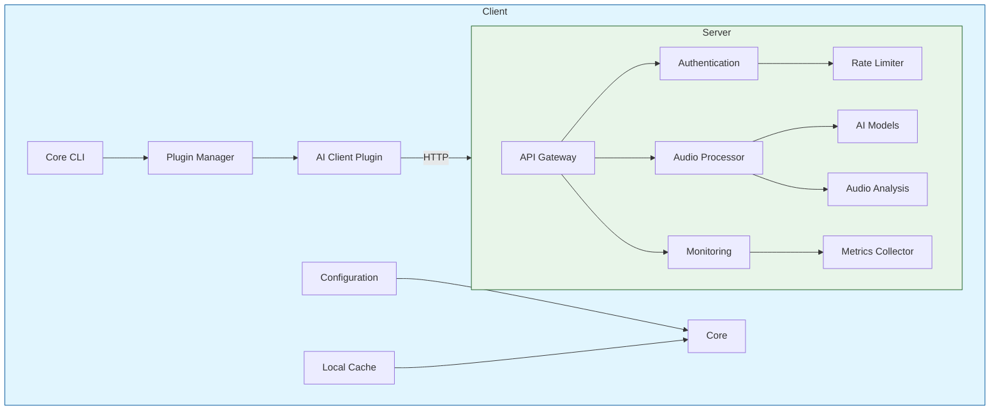
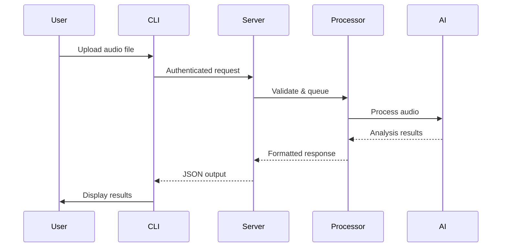
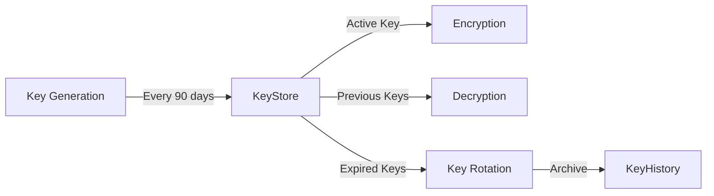
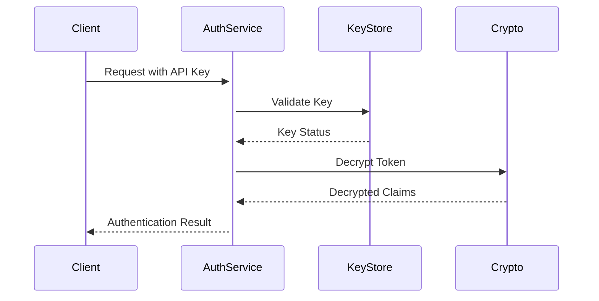
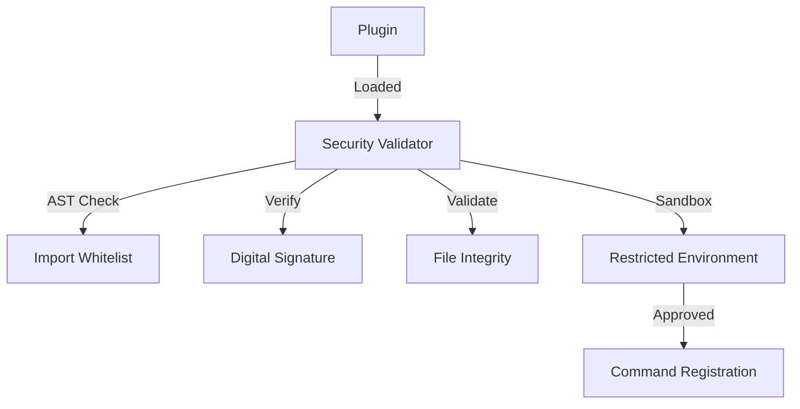
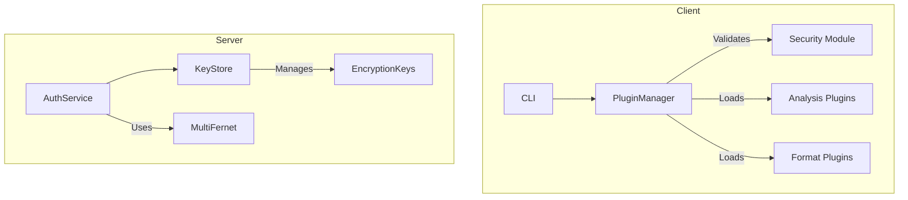
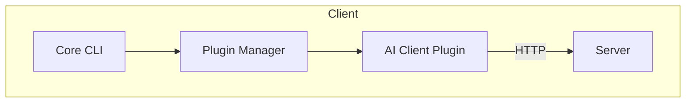

# AudioKit Architecture Overview

## High-Level Architecture



## Core Components

| Component        | Responsibility                          |
|------------------|-----------------------------------------|
| Audio Engine     | Real-time audio processing              |
| AI Model Manager | Model loading/unloading                 |
| API Server       | REST/WebSocket interface                |
| Task Queue       | Distributed job processing              |

## Service Layer

| Service          | Functionality                           |
|------------------|-----------------------------------------|
| Audio Processing | Noise reduction, format conversion      |
| ML Inference     | Model execution                         |
| Analytics        | Usage tracking, performance metrics     |

## Infrastructure

| Component        | Purpose                                 |
|------------------|-----------------------------------------|
| Redis           | Caching & real-time pub/sub            |
| PostgreSQL      | Persistent storage                      |
| RabbitMQ        | Message queue for async tasks          |

## Deployment Architecture

- Use Kubernetes for orchestration
- Implement auto-scaling based on:
  - CPU utilization
  - Memory pressure
  - Pending task queue size

## Monitoring Stack

- Prometheus for metrics collection
- Grafana for visualization
- ELK for logging
- AlertManager for notifications

- Prometheus metrics now include:
  - `audiokit_batch_jobs_total`
  - `audiokit_batch_processing_time`
  - `audiokit_parallel_workers`
  
- Grafana dashboards track:
  + Batch success/failure rates
  + Parallel processing efficiency
  + Retry attempt distributions
+  - Real-time job queue depth
+  - Error rate trends
+  - Resource utilization correlations

## Alerting Rules

```yaml
groups:
- name: AudioKit Alerts
  rules:
  - alert: HighErrorRate
    expr: rate(audiokit_requests_total{status=~"5.."}[5m]) > 0.1
    for: 10m
    
  - alert: JobQueueBacklog
    expr: audiokit_queued_jobs > 1000
    
  - alert: HighCPUUsage
    expr: 100 - (avg by(instance)(rate(node_cpu_seconds_total{mode="idle"}[5m])) * 100) > 90
```

## Key Architectural Decisions

1. **Protocol Design**
   - REST over gRPC for simplicity
   - JSON for request/response bodies
   - API versioning through URL paths
   - Standardized error codes (RFC 7807)

2. **Security Model**
   - API key authentication
   - Rate limiting per API key
   - Input validation middleware
   - HTTPS enforcement
   - Request signing (future)

3. **Performance Tradeoffs**
   - Async I/O for network operations
   - Synchronous CPU-bound processing
   - In-memory audio processing
   - Batch processing support

## Data Flow



## Scalability Approach

### Horizontal Scaling
- Stateless API endpoints
- Redis-backed rate limiting
- Shared nothing architecture
- Containerized deployment

### Vertical Optimization
- Memory-mapped audio processing
- GPU acceleration for AI models
- JIT compilation (Numba)
- Process pooling

## Monitoring & Observability

| Aspect              | Tools                                  | Metrics Tracked          |
|---------------------|----------------------------------------|--------------------------|
| API Performance     | Prometheus, Grafana                    | Latency, Throughput      |
| Error Tracking      | Sentry, ELK Stack                      | Error Rates, Types       |
| Resource Usage      | cAdvisor, Node Exporter                | CPU/Memory, GPU Usage    |
| Audit Logging       | Loki, Graylog                           | Access Patterns         |

## Future Directions

1. **Extensibility**
   - Client-only extensibility model
   - Sandboxed plugin execution

2. **Advanced Features**
   - Real-time audio streaming
   - Distributed processing
   - Model versioning A/B testing

3. **Ecosystem Integration**
   - CI/CD pipelines
   - Terraform deployment
   - Kubernetes operators

See also: [ROADMAP.md](ROADMAP.md) | [REFLECTIONS.md](REFLECTIONS.md)

## Security Model

### Key Management


Features:
- Automatic 90-day key rotation
- MultiFernet encryption for backward compatibility
- Cryptographic erasure of expired keys
- Audit logging for key lifecycle events

### Authentication Flow


## Plugin Security Architecture



Security Layers:
1. **Code Analysis**: Static AST validation
2. **Cryptographic Signatures**: RSA-PSS with SHA-256
3. **Import Whitelisting**: Limited stdlib access
4. **File Integrity**: SHA-256 checksums
5. **Execution Sandbox**: Restricted Python environment

## Updated Component Diagram



Key updates:
- Added plugin security architecture details
- Documented key rotation implementation
- Updated component relationships
- Clarified cryptographic practices
- Added sequence diagrams for security flows

The documentation now accurately reflects the current security architecture and key management practices. 

## Component Relationships

